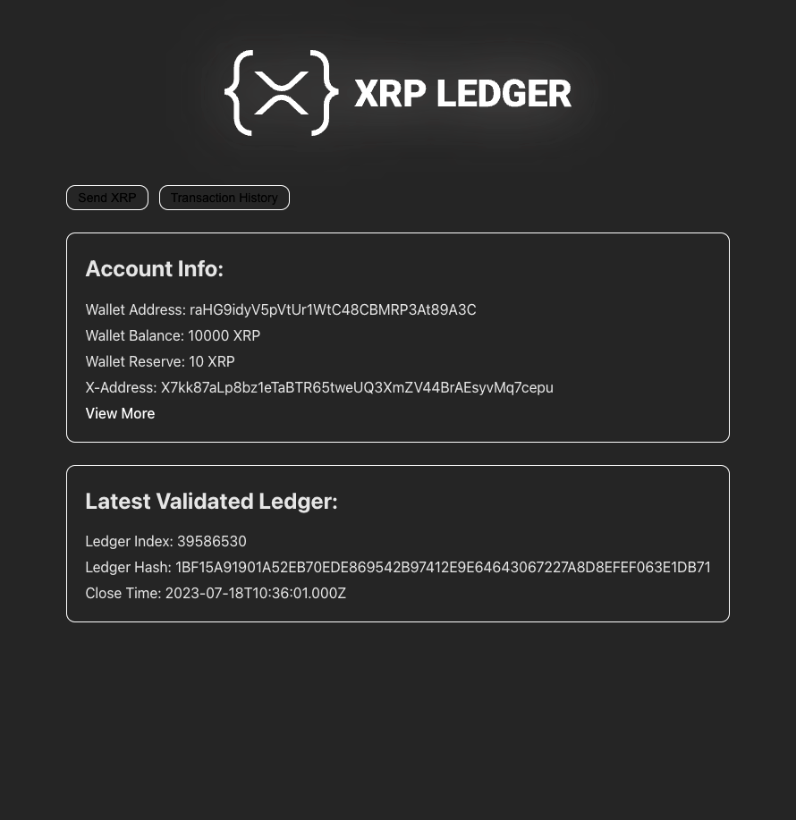
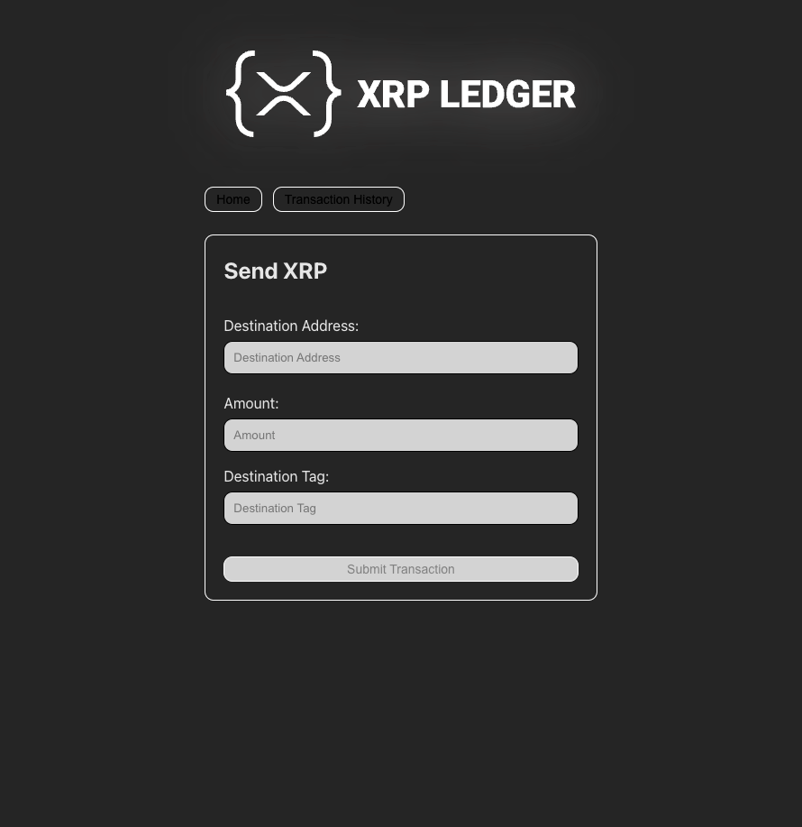
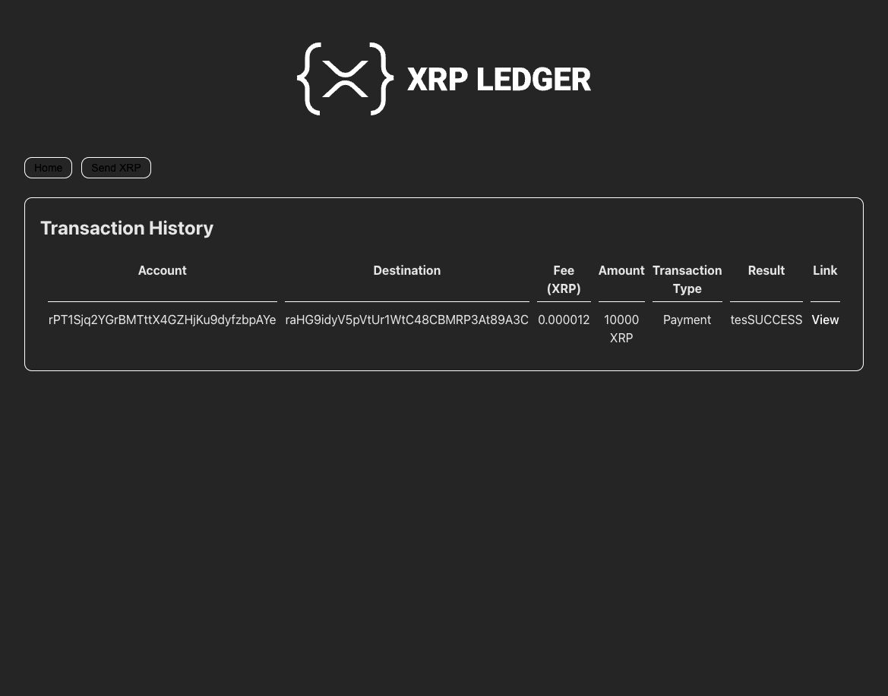

# XRPL-Wallet

XRPL-Wallet is a simple browser-based wallet for the XRP Ledger, built using JavaScript and various libraries. The wallet provides an easy-to-use interface to interact with the XRP Ledger, view wallet details, and send XRP transactions.

## Prerequisites

Before getting started, ensure you have the following:

- Node.js v14 or higher installed.
- Yarn (v1.17.3 or higher) installed.
- Familiarity with JavaScript programming.

## Features

- Display wallet information, including address, balance, reserve, and X-Address.
- View the latest validated ledger details, including index, hash, and close time.
- Send XRP transactions directly from the wallet interface.
- View transaction history for the connected XRP account.
- Simple and intuitive user interface for easy navigation.

## Screenshots

## How to Use

1. Clone this repository to your local machine.
2. Install project dependencies using `yarn install`.
3. Build the project using `yarn build`.
4. Open the `index.html` file in your browser to launch the XRPL-Wallet.

## Project Structure

The project is structured as follows:

- `index.html`: The main HTML file that renders the XRPL-Wallet interface.
- `index.js`: The JavaScript file responsible for connecting to the XRP Ledger, fetching wallet details, and handling user interactions.
- `index.css`: The CSS file containing styles for the XRPL-Wallet interface elements.
- `src`: A directory containing helper functions and resources for the wallet.

## Customization

Feel free to customize the styling in the `index.css` file to match your preferred design. You can also extend the functionality of the wallet to include additional features, such as sending and receiving XRP, viewing transaction details, or integrating with other blockchain networks.

## Contributing

Contributions to XRPL-Wallet are welcome! If you have any improvements, bug fixes, or new features to add, please submit a pull request.

## License

This project is licensed under the [MIT License](LICENSE). Feel free to use, modify, and distribute it as per the terms of the license.

## Acknowledgments

Special thanks to the XRPL community and the contributors to the libraries used in this project, making it possible to interact with the XRP Ledger in the browser.

Let's build a secure and easy-to-use wallet for the XRP Ledger together! Happy coding!
